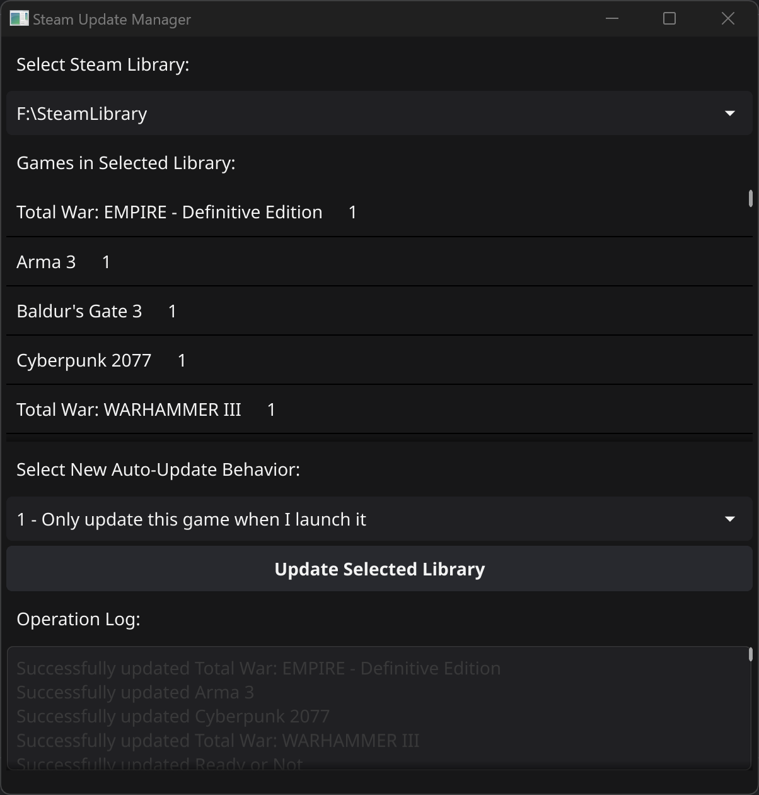

# Steam Update Manager

Steam Update Manager is a tool designed to help Steam users manage the auto-update settings for their games across multiple Steam libraries. It provides a simple graphical interface to view and modify the auto-update behavior of all games in a selected Steam library.

## Features

- Automatically detects Steam libraries on your system
- Lists all games in each Steam library
- Displays current auto-update behavior for each game
- Allows batch updating of auto-update settings for all games in a library
- Provides a log of update operations

## Installation

You can download the latest version of Steam Update Manager from our [GitHub Releases page](https://github.com/looterz/SteamUpdateManager/releases). 

To install:

1. Go to the [Releases page](https://github.com/looterz/SteamUpdateManager/releases).
2. Find the latest release and download the `SteamUpdateManager.exe` file.
3. Run the `SteamUpdateManager.exe` file to start the application.

Note: Steam Update Manager is currently only available for Windows 64-bit systems.

If you encounter any issues during installation or use, please [open an issue](https://github.com/looterz/SteamUpdateManager/issues) on our GitHub repository.

## How It Works

The Steam Update Manager scans your system for Steam libraries and reads the `appmanifest_*.acf` files to gather information about installed games. It then allows you to select a library and view all the games in that library along with their current auto-update settings.

You can choose to update the auto-update behavior for all games in the selected library to either:

- "0 - Always keep this game updated"
- "1 - Only update this game when I launch it"

The tool then modifies the appropriate `appmanifest_*.acf` files to apply the new setting.

## Usage

1. Run the application
2. Select a Steam library from the dropdown menu
3. View the list of games and their current auto-update settings
4. Choose the desired auto-update behavior from the dropdown
5. Click "Update Selected Library" to apply the changes
6. View the operation log for details on the update process
7. Restart Steam to see the changes in the steam client

## Requirements

- Go 1.16 or later
- Fyne v2

## Building and Running

To build and run the Steam Update Manager:

1. Ensure you have Go installed on your system
2. Install Fyne v2: `go get fyne.io/fyne/v2`
3. Clone this repository
4. Navigate to the project directory
5. Run `go build` to compile the application
6. Run the resulting executable

## Note

This tool modifies Steam game manifest files. While it's designed to be safe, it's always a good idea to back up your Steam files before making changes. Use at your own risk.

## Contributing

Contributions, issues, and feature requests are welcome. Feel free to check issues page if you want to contribute.

## License

[MIT License](LICENSE)
